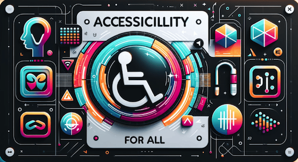

# ♿  Accessibilik: accessibility widget.

Accessibilik: A React-based web accessibility widget to enhance UI/UX for all users.

## 🔥 Features
🇸🇨 **Multilingual Support**: Supports multiple languages **(38 languages) ** :  
 Hebrew, English, Russian, Chinese mandarin, Spanish, Arabic, Bengali, Hindi, Portuguese, Japanese, German, Chinese, Korean, French, Turkish, Vietnamese, Telugu, Marathi, Tamil, Italian, Urdu, Gujarati, Polish, Ukrainian, Persian, Malayalam, Kannada, Oriya, Romanian, Azerbaijani, Hausa, Burmese, Serbocroatian, Thai, Dutch, Yoruba, Sindhi 

🔤 **Adjust Font Size**: offers users the ability to easily modify text size for optimal readability, enhancing accessibility for those with visual impairments or reading preferences. This feature ensures a comfortable and inclusive browsing experience for all users.

📑 **Align Text**: provides users with the capability to adjust text alignment, offering options like left, right, center, or justified, catering to personal reading preferences and enhancing overall readability.

🧠 **Dyslexia Font**: enables users to switch to a dyslexia-friendly font, improving readability and reducing visual stress for those with dyslexia, thereby fostering a more inclusive browsing experience.

🔤 **Font Weight**: This feature enables users to customize text thickness from light to bold, enhancing readability and accommodating diverse visual needs for a comfortable reading experience.

🔤 **Highlight Links**: This feature automatically highlights all hyperlinks on the page, making them more prominent and easier to locate, thus enhancing navigation and usability for all users, especially those with visual impairments.

🔤 **Highlight Titles**: Enhances the visibility of headings and titles by adding distinct highlighting, aiding users in quickly identifying key sections and improving overall content navigation.

🔤 **Letter Spacing**: Allows users to adjust the spacing between characters in texts, enhancing readability and reducing visual strain, especially beneficial for those with dyslexia or other reading difficulties.

🔤 **Line Height**: Provides the ability to alter the space between lines of text, improving legibility and comfort for reading, particularly helpful for users with visual impairments or reading disorders.

🔤 **Word Spacing**: Offers the option to modify the spacing between words, aiding in better readability and visual comfort, especially for users with dyslexia or other reading challenges.

🔍 **Zoom Button**: This feature enables a full-page zoom, magnifying both text and images for enhanced visibility, catering to users with visual impairments and improving overall accessibility.

🖌 **BlueLight Filter**: Reduces blue light emission from the screen, diminishing eye strain and improving viewing comfort, especially beneficial for users during extended use or in low-light conditions.

🖌 **Brightness Control**: Allows users to adjust the screen brightness directly through the website, enhancing visual comfort and reducing eye strain, especially in varying light environments.

🖌 **DarkContrast Button**: Activates a high-contrast, dark mode color scheme, reducing glare and eye strain, ideal for users with light sensitivity or those preferring a darker interface for easier reading.

🖌 **HighContrast Button**: Enables a high-contrast color mode, enhancing text and image visibility against backgrounds, crucial for users with visual impairments or color vision deficiencies.

🖌 **HighSaturation Button**: This feature enhances color saturation, making hues more vivid and distinct, which can be beneficial for users with color vision deficiencies or those who prefer more vibrant visuals.
